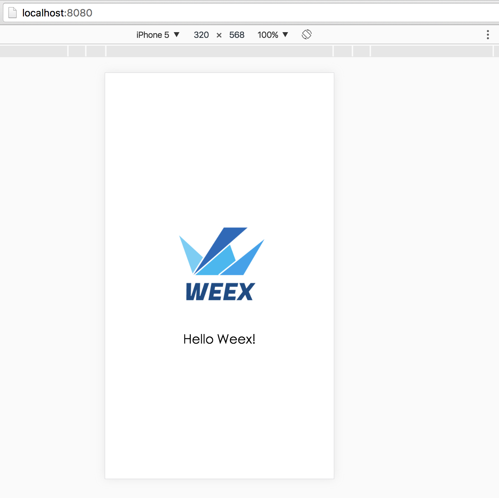
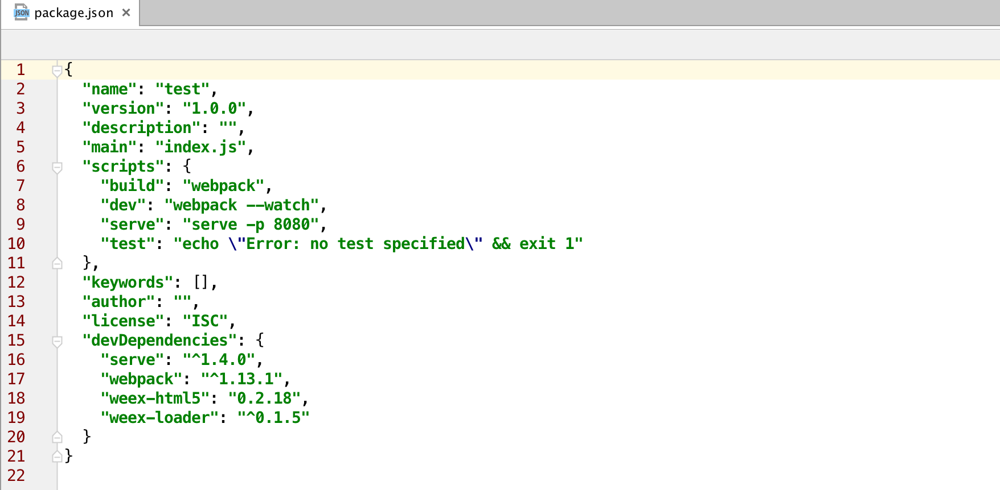
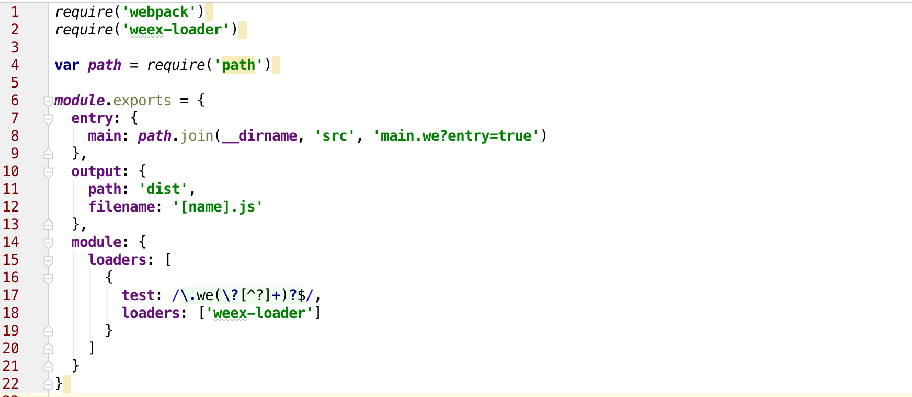

## 第3篇 初始化工程  
初始化工程是一个项目开发的第一步。迈出了这一步，你就成功了一半。我相信大部分同学构建了一个项目，是会拼着老命写完的（逃...）。      

 这里，我尝试用简单的方式来说明一个工程的构建。然后，再将简单的方式工程化（复杂化），最后拼凑成目前weex开源的代码结构。   
   
 
## 安装weex-toolkit       

weex-toolkit是一个很好的工具供我们工程构建。首先，第一步是安装该工具：   

	$npm install -g weex-toolkit       
	
测试weex-toolkit是否安装成功，可以使用如下命令测试：       

	$ weex --version	   
	info 0.4.4      

如果显示版本号即为成功。         

## 创建项目     
这里，我们不再使用weex 跑一个文件的形式。我们需要一个较为完整的方案，因此，这里采用weex init命令创建项目。         

首先，我们创建一个目录存放我们的项目，启动命令行：     

	$ mkdir test      
	$ cd test    
	$ weex init 
		//下面一路空格即可
		prompt: Project Name:  (test) 
		file: .gitignore created.
		file: README.md created.
		file: index.html created.
		file: package.json created.
		file: src/main.we created.
		file: webpack.config.js created.     
		
## 跑起项目     
首先，我们需要安装依赖。以后大家看到package.json文件，就可以直接npm i 安装模块了。**但是**, 有些项目需要确保下载的依赖和目前的版本一致，这就是工程一致性的后话了。		   

	$ npm install 
	
依赖安装完成，启动项目编译。

	$ npm run dev       
		
 启动轻量服务器。    
 
 	$ npm run serve		    
 	
 这时，打开浏览器，输入http://127.0.0.1:8080, 就会看到如下界面效果:       
 
       	
          
## npm run dev干了什么事儿      
当然这一些都是node/npm的常识了。首先，我们打开package.json文件。可以看到如下代码：     
 
        
 
 我们可以看到scripts里面包含了build、dev、serve、test四个属性。例如dev属性,npm run dev实际上相当于 webpack --watch。即等同开发者做了这件事:   
 
 	$ webpack --watch        
 	
 ok，看到这里明白了。npm run dev调用了webpack。那么，webpack实际上是执行了配置文件。     
 webpack默认是webpack.config.js作为配置文件的。所以看一下webpack.config.js中的内容。       
 
 	        
 
  这个文件比较好理解。一个是引入了webpack的配置，一个是使用了weex-loader模块。      
  entry属性是表示入口文件，output表示输出文件，默认输出到dist问价夹。所有打开dist就可以看到一个打包完成的main.js文件。      
  
## npm run serve  
这个同上，不做展开，主要是做一个服务器，提供浏览器访问静态资源。     

## 入口文件index.html          
是时候，去了解我们index.html文件干了一件啥事。其实，index.html就是页面的入口文件。具体大码如下：            

```html
<!DOCTYPE html>
<html>
<head>
  <meta charset="utf-8">
  <title>Weex HTML5</title>
  <meta name="apple-mobile-web-app-capable" content="yes" />
  <meta name="apple-mobile-web-app-status-bar-style" content="black" />
  <meta name="apple-touch-fullscreen" content="yes" />
  <meta name="format-detection" content="telephone=no, email=no" />
  <style>
    html, body, #weex {
      width: 100%;
      height: 100%;
    }
  </style>
  <script src="./node_modules/weex-html5/dist/weex.js"></script>
</head>
<body>
  <div id="weex"></div>
  <script>
  /**
   * Init weex instance depending on the url params.
   * There are three ways to load weex bundles, depends on the
   * parameter 'loader' in the url:
   *
   *   + xhr: use XMLHttpRequest. Parameter 'page' should be
   *   the bundle's url.
   *   + source: use the transformed code itself. 'page' should
   *   be the transformed weex bundle.
   *
   * @param {String} bundle - It has different meaning depends on
   *   the type of loader.
   */
  (function () {
    function getUrlParam (key) {
      var reg = new RegExp('[?|&]' + key + '=([^&]+)')
      var match = location.search.match(reg)
      return match && match[1]
    }

    var loader = getUrlParam('loader') || 'xhr'
    var page = getUrlParam('page') || 'dist/main.js'

    window.weex.init({
      appId: location.href,
      loader: loader,
      source: page,
      rootId: 'weex'
    })
  })();
  </script>
</body>
</html>
```

作为入口和载体，htmk做了两件事：     
1) 拿到页面的URL，根据page参数获得需要加载的js文件路径    
2）初始化weex实例，加载文件。     
此处文章可参考：http://alibaba.github.io/weex/doc/advanced/integrate-to-html5.html     
    

## 是否可以更好的理解weex github源码结构     
到这里，整个weex项目的来龙去脉，应该是比较清楚了。那么，回过头来看，weex开源代码如何构建，应该是件水到渠成的事了。比如看这段打包的配置代码：https://github.com/alibaba/weex/blob/dev/build/webpack.examples.config.js          

```javascript
var path = require('path');
var fs = require('fs');

var entry = {};

function walk(dir) {
  dir = dir || '.'
  var directory = path.join(__dirname, '../examples', dir);
  fs.readdirSync(directory)
    .forEach(function(file) {
      var fullpath = path.join(directory, file);
      var stat = fs.statSync(fullpath);
      var extname = path.extname(fullpath);
      if (stat.isFile() && extname === '.we') {
        var name = path.join('examples', 'build', dir, path.basename(file, extname));
        entry[name] = fullpath + '?entry=true';
      } else if (stat.isDirectory() && file !== 'build' && file !== 'include') {
        var subdir = path.join(dir, file);
        walk(subdir);
      }
    });
}

walk();

module.exports = {
  entry: entry,
  output : {
    path: '.',
    filename: '[name].js'
  },
  module: {
    loaders: [
      {
        test: /\.we(\?[^?]+)?$/,
        loader: 'weex'
      },
      {
        test: /\.js(\?[^?]+)?$/,
        loader: 'weex?type=script'
      },
      {
        test: /\.css(\?[^?]+)?$/,
        loader: 'weex?type=style'
      }, 
      {
        test: /\.html(\?[^?]+)?$/,
        loader: 'weex?type=tpl'
      }
    ]
  }
}
```     

就是编译examples目录下所有.we文件到build目录。代码可以细看，都是Node.js File System相关的API.     
            
        

