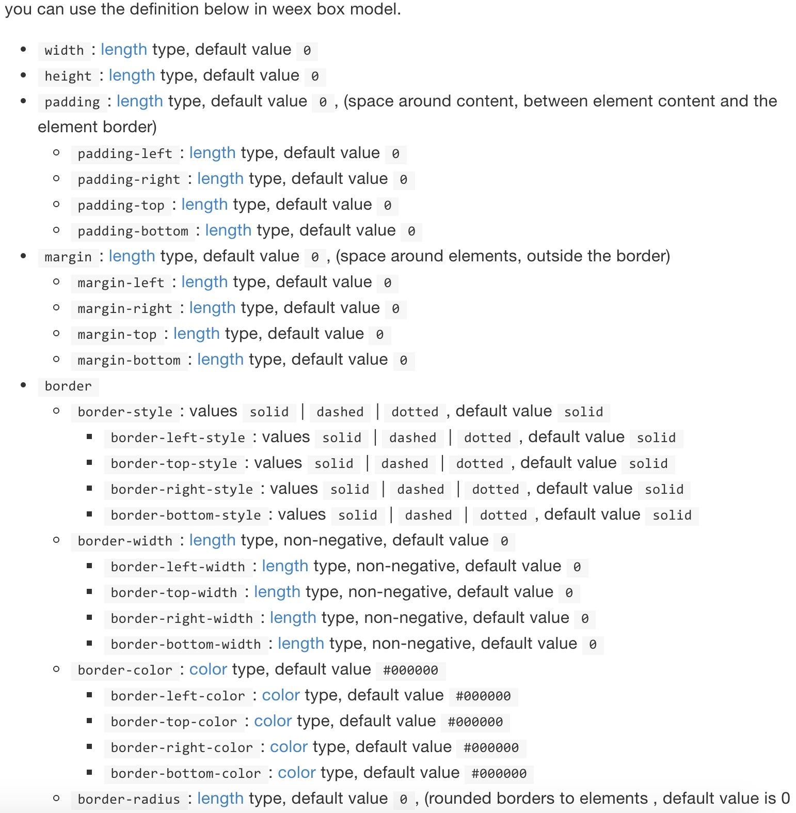

## 第5篇 模版、样式、JavaScript       
模版的概念，应该是前端借鉴了后端，不仅可以做到逻辑与视图分离，进行数据绑定，还可以提高开发效率，减少维护成本。Weex的模板语法也是极简的。      

## 一、template        
### 模版概述   
在.we文件中，template里面的内容就是视图模版。例如：      
   
```html
<template>
  <!-- (required) the structure of page -->
</template>
```     

有几点需要注意的：      
1）不建议template的内容层次太深       
2）template内必须包含唯一的根节点作为父容器, div就是一个很好的选择       
   
```html
<template>
  <div>
  	<div>子组件</div>
  	<div>子组件</div>
  </div>
</template>
```  	     
3）template内部组件必须是weex官方提供的组件。例如：div、text、input、web等。这里的组件就不是单纯的html标签了，更加丰富的含义应该是三端一致的基础组件。         

### 模版逻辑     
一般情况，我们可以在模版中进行逻辑判断和表达式运算。Weex也做了基础的逻辑运算工作。      

+ if    

```html    
<template>
  <div>
  	<div if="{{shown}}">子组件</div>
  	<div>子组件</div>
  </div>
</template>
```  	     
shown为bool类型的变量。如果为true，则显示该组件，否则移除该组件。      

+ repeat    

```html
<template>
  <container>
    <container repeat="{{list}}">
      <image src="{{avatar}}"></image>
      <text>{{nickname}}</text>
    </container>
  </container>
</template>
```   
repeat接受循环的数组变量。repeat内部组件引用数组中某一元素的属性，例如list[i].avatar。     

+ $index        

```html
<div repeat="{{list}}">
  <text>No. {{$index + 1}}</text>
<div>
```    
可以通过$index 拿到数组遍历的索引。    

+ key and value   

```html
<div repeat="{{v in list}}">
  <text>No. {{$index + 1}}, {{v.nickname}}</text>
</div>

<div repeat="{{(k, v) in list}}">
  <text>No. {{k + 1}}, {{v.nickname}}</text>
</div>
```       

## 二、样式       
Weex的样式基本上是web标准样式的子集。Weex样式分为内联样式和类样式。      

```html
<div style="width:100;height:100;margin-left:10;"></div>
```
```html
<template>
	<div class="header_container border"></div>
</template>	    
<style>
	.header_container{
		width:100;
		height:100;
		margin-left:10;
	}
	.border{
		border-width:1;
	}
</style>
```     
 我们可以看到内联样式基本上和Web标准一样。但是这里不要使用px，因为默认的宽度和高度单位就是px。       
 类样式，我们写在```<style>```里面，基本和Web标准一致。但是我们需要注意几个问题：       
 
### 1. Weex支持哪些样式？  
1）样式的形式：内联style属性、style标签内部类样式     
2）基础样式：包括盒子模型和Flexbox                     
	             
	 Weex支持的公共样式在这里都基本说明了：http://alibaba.github.io/weex/doc/references/common-style.html    
3) 文本的样式：因为text组件是一个相对特殊的组件，有着自己的特有属性。例如font-size设置字体的大小。lines设置文本的行数。可以参考：    
http://alibaba.github.io/weex/doc/references/text-style.html     
http://alibaba.github.io/weex/doc/components/text.html   
	
	
 
### 2. 样式是否支持数据绑定      
答案：支持。      

```html
<template>
  <container>
    <text style="font-size: {{fontSize}};">Alibaba</text>
    <text class="large {{textClass}}">Weex Team</text>
  </container>
</template>
<style>
  .large {font-size: 32;}
  .highlight {color: #ff0000;}
</style>
<script>
  module.exports = {
    data: {
      fontSize: 32,
      textClass: 'highlight'
    }
  }
</script>
```    
例如fontSize、textClass就是数据绑定。如果不了解数据绑定，可以移步到下一节。      


## 三、JavaScript             
首先，这里我们需要明确JavaScript的范围以及JavaScript如何使用。在Weex中，我们使用 mustache的语法形式```{{}}```来进行数据绑定。我们在script中的data属性上进行的数据绑定，都会自动的映射到视图，从而进行视图的更新。 例如：  

```html   
<template>
  <container>
    <text style="font-size: {{size}}">{{title}}</text>
  </container>
</template>

<script>
  module.exports = {
    data: {
      size: 48,
      title: 'Alibaba Weex Team'
    }
  }
</script>      
```    
这里，我们不仅对样式进行了数据绑定，同样对text组件中的文本进行了数据绑定。     

当然，weex也支持，简单的表达式，例如：       

```html
<template>
  <container style="flex-direction: row;">
    <text>{{firstName + ' ' + lastName}}</text>
  </container>
</template>

<script>
  module.exports = {
    data: {
      firstName: 'John',
      lastName: 'Smith'
    }
  }
</script>
```        
 我们将```firstName + ' ' + lastName```进行了运算。    
 那么，如果我们的模板中有大量的逻辑。我们怎么办？        
 
 ```html
 <template>
  <container style="flex-direction: row;">
    <text>{{fullName}}</text>
    <text onclick="changeName" style="margin-left:10px;">CHANGE NAME</text>
  </container>
</template>

<script>
  module.exports = {
    data: {
      firstName: 'John',
      lastName: 'Smith'
    },
    computed: {
      fullName: {
        get: function() {
          return this.firstName + ' ' + this.lastName
        },

        set: function(v) {
          var s = v.split(' ')
          this.firstName = s[0]
          this.lastName = s[1]
        }
      }
    },
    methods: {
      changeName: function() {
        this.fullName = 'Terry King'
      }
    }
  }
</script>
 ``` 
 我们可以使用computed对字段进行相关的逻辑运算。     
 
 那么，我们又如何给一个元素绑定事件？      
 直接onclick就好，注意是全部小写。例如：      
 
 ```html
 <template>
  <text onclick="toggle">Toggle</text>
</template>

<script>
  module.exports = {
    methods: {
      toggle: function () {
        // todo
      }
    }
  }
</script>
 ```     
 每个组件有各自的事件，因此，可以通过  http://alibaba.github.io/weex/doc 多多阅读和了解。
 

## 四、组件的范畴和需要关注的点     
在HTML中，我们称div这些为标签。但是，这里，我们建议text、div、input、a、web等等这些称之为组件。因为他们是跨三端协作一致的结果。那么作为一个组件，我们需要关注什么呢？     

+ 组件都是成对出现 
          
```html
//good case
<list></list>
//bad case
<list/>  
```      
+ 组件的内容或者子组件是什么？      
例如text组件：This component supports no child components but a text content.      
因此，在使用text组件时不要有子组件，但是可以有文本内容。     

+ 组件支持的属性有哪些？    
比如list组件是否支持纵向／横向滚动，这些都是需要阅读文档时需要注意的。      

+ 组件支持什么样的样式     
+ 组件支持什么样的事件      
比如input组件是不允许子组件的，同时不支持click事件，支持input/change事件。这些是需要我们关注的点。     
+ Weex文档中未出现的组件能否使用？    
可以，自己把他扩展成三端一致的组件呗，:)     

