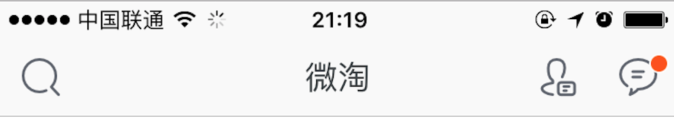

## 第六篇 导航、页面跳转、stream、webview    
在一款应用中，导航、页面切换、获取网络数据是很常见的功能。因此，本节做一个简单的介绍。             

## wxc-navpage组件     
什么是navigation？如下图:        
        
在iOS，使用的控制是UINavigationController。我们可以看到Navigation的内容比较多，例如中间的标题、左侧的搜索图片、右侧的图片等。同样，Weex也提供了该组件，那就是wxc-navpage。    

```html
<template>
  <wxc-navpage height={{...}} background-color="..." title="..." title-color="..." left-item-title="..." left-item-color="..." right-item-src="...">
      <content> ...</content>
  </wxc-navpage>
</template>
<script>
  require('weex-components');
  module.exports = {
    created: function() {
        this.$on('naviBar.rightItem.click',function(e){
           //handle your click event here.
        });

        this.$on('naviBar.leftItem.click',function(e){
          //handle your click event here. 
        });
    }
  }
</script>   
```
我们，可以看到 wxc-navpage不仅支持基础的样式，同样提供了 title、title-color、 left-item-title、left-item-color、right-item-src等等属性，这里可以参考http://alibaba.github.io/weex/doc/components/wxc-navpage.html 。       

wxc-navpage内嵌子组件，即```<content> ...</content> ```。但是，我们改造上面的片段代码是跑不起来的。因此我们需要安装weex-components：         

```shell
$ npm install  weex-components
```    
weex-components中包含的内容比较多，例如也提供了**wxc-tabbar**组件。但是，需求是多样的。有时候，发现weex-components组件不能满足一些特定的需求。那么，这里提供2个思路：**（1）给weex提issues，让weex支持新的需求 （2）如果实在等不及，可以将weex-components从node_modules中拷贝出来，然后修改里面的内容。**         

 
## 页面跳转      
很可能一个应用需要多个页面，那么多个页面如何跳转呢？其实Weex的Demo就给出了很好的例子。例如，这里的代码如下：     

 ```javascript
var bundleUrl = this.$getConfig().bundleUrl;
bundleUrl = new String(bundleUrl);
console.log('hit', bundleUrl);
var nativeBase;
var isAndroidAssets = bundleUrl.indexOf('file://assets/') >= 0;

var isiOSAssets = bundleUrl.indexOf('file:///') >= 0 && bundleUrl.indexOf('WeexDemo.app') > 0;
if (isAndroidAssets) {
   nativeBase = 'file://assets/';
}
else if (isiOSAssets) {
    // file:///var/mobile/Containers/Bundle/Application/{id}/WeexDemo.app/
    // file:///Users/{user}/Library/Developer/CoreSimulator/Devices/{id}/data/Containers/Bundle/Application/{id}/WeexDemo.app/
    nativeBase = bundleUrl.substring(0, bundleUrl.lastIndexOf('/') + 1);
}
else {
   var host = 'localhost:12580';
   var matches = /\/\/([^\/]+?)\//.exec(this.$getConfig().bundleUrl);
   if (matches && matches.length >= 2) {
      host = matches[1];
   }
   nativeBase = 'http://' + host + '/' + this.dir + '/build/';
}
var h5Base = './index.html?page=./' + this.dir + '/build/';
// in Native
var base = nativeBase;
if (typeof window === 'object') {
    // in Browser or WebView
    base = h5Base;
}
this.baseURL = base;  
 ```   
  上面的代码是我从Weex Demo中拔出来的。这一块也是经常被开发者问到的，就是跳转路径的问题。其实，仔细看上面的代码，我们只需要关注两个地方，一个是```this.dir```，另一个是```var h5Base = './index.html?page=./' ```。      
 我们在created方法中获取到this.dir。this.dir 则是我们打包完成的js bundle的目录。h5Base则是web端的路径。它的基本形式是:         
 
  ```
  http://127.0.0.1:8080/index.html?page=./dist/index.js   
  ```
  其中index.html则是web端运行的载体，page=./dist/index.js则是传入到weex init中的参数。我们一般在集成web时候，会写上如下代码：        
  
  ```javascript
  (function () {
  function getUrlParam (key) {
    var reg = new RegExp('[?|&]' + key + '=([^&]+)')
    var match = location.search.match(reg)
    return match && match[1]
  }
  var loader = getUrlParam('loader') || 'xhr'
  var page = getUrlParam('page') || 'examples/build/index.js'
  // jsonp callback name should be specified or be the default
  // value 'weexJsonpCallback' if the 'jsonp' loader is used.
  var JSONP_CALLBACK_NAME = 'weexJsonpCallback'
  window.weex.init({
    jsonpCallback: JSONP_CALLBACK_NAME,
    appId: location.href,
    loader: loader,
    source: page,
    rootId: 'weex',
    downgrade: []  // 'list', 'scroller'
  })
})();
  ```    
  getUrlParam就是获取url中的参数。如果页面有page参数，我们则调用page参数对应的js文件的代码。     
  到这里，基本上，可以看出跳转路径了。那么使用什么API跳转呢？那就是navigator。
  
```javascript   
var url = this.recommend[index].url;
var title = this.recommend[index].title;
var navigator = require('@weex-module/navigator');
var params = {
     'url': this.baseURL + 'yywebview.js?weixin_title=' + title + '&weixin_url=' + url,
     'animated' : 'true',
}
console.log('------',params.url);
navigator.push(params, function(e) {});    
```
我们获取到this.baseUR，然后拼接路径。this.baseUR则是created方法中获取到不同端的路径前缀。这里，引入了```navigator = require('@weex-module/navigator');```组件，然后使用了push方法，将路由对象添加进了**路由栈**。如果我们需要回退到上一个视图，该如何呢？其实navigator api已经提供了该功能，那就是pop。具体可以参考http://alibaba.github.io/weex/doc/modules/navigator.html 。   

## 网络请求      
Weex提供了网络请求模块，那就是stream。简单的例子如下：          

```javascript
stream.fetch({
  method: 'GET',
  url: "http://httpbin.org/get",
  type:'json'
}, function(response) {
  //process response
},function(response){
  //progress response
  console.log("current bytes received:"+response.length);
});
```    
基本上stream.fetch方法的几个参数都很容易理解。如果需要POST、PUT、DELETE等。可以参考： https://github.com/alibaba/weex/blob/dev/examples/module/stream-demo.we 。    

## webview    
当然，在Weex中也支持Webview类似组件，只是Weex命名其为web。具体使用如下：      

```html
<template>
    <div class="wrapper">
        <web class="web" src="{{src}}" style="height:{{height}};" onpagestart="pagestart" onpagefinish="pagefinish" onerror="error"></web>
    </div>
</template>


<style>
    .text{
        font-size:26;
    }

    .web{
        flex:1;
    }
</style>
```   
 其中src就是我们要打开的网页地址。onpagestart、onpagefinish、onerror几个事件很重要。比如在onpagefinish时去掉loading，onerror时给用户友好提示。 具体参考：http://alibaba.github.io/weex/doc/components/web.html 。     


  

 
