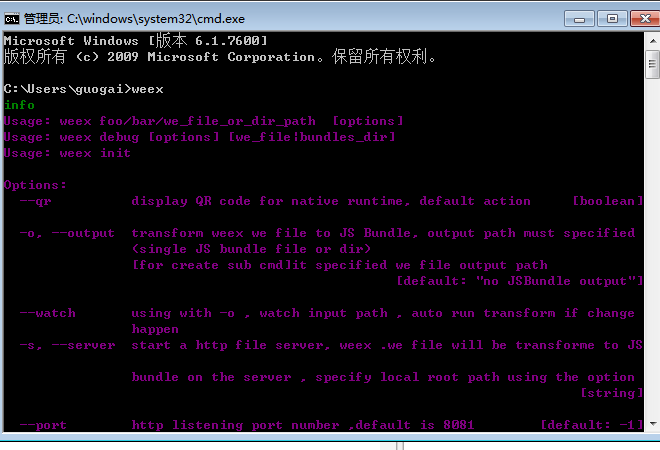

## 环境配置       
作者： @guogai       

- 1.下载并安装Jdk [传送门](http://www.oracle.com/technetwork/java/javase/downloads/jdk8-downloads-2133151.html)，下载完成以后，按照提示一步一步执行即可。
- 2.配置Jdk [传送门](http://jingyan.baidu.com/article/6dad5075d1dc40a123e36ea3.html)。
- 3.下载AndroidStudio [传送门](http://www.androiddevtools.cn/)，我一般选择推荐安装的那个。不要想着去谷歌官网下载，不要问为什么。
- 4.安装配置AndroidStudio。[传送门](http://www.tuicool.com/articles/AVjAva)，后续会重新传送一个门。
- 5.下载并安装nodejs [传送门](https://nodejs.org/en/)。
- 6.安装weex命令行工具。打开命令行，执行命令：```npm install -g weex-toolkit```，等待运行结束，验证是否安装成功，执行命令：	```weex```，出现下图，代表安装成功。

  
  
- 7.下载并安装Android模拟器（假设你没有安卓手机）。国内的模拟器感觉都差不多，就放一个我用过的，几乎不出啥问题的,就是不能选择手机型号，优点，下载安装速度都比较快，天天模拟器 [传送门](http://www.ttmnq.com/)。国外的模拟器一般选择用Genymotion [传送门](http://jingyan.baidu.com/article/3ea51489e7d8bd52e61bba36.html)，启动速度和运行速度都比原生的快很多。

## Q&A
- 1.为啥不用谷歌原生的模拟器？ 

        启动运行速度慢的可以打一盘lol了，也没有这么夸张。