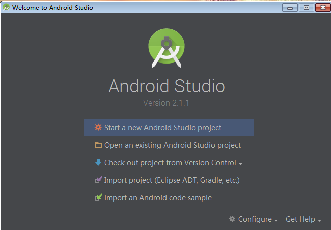
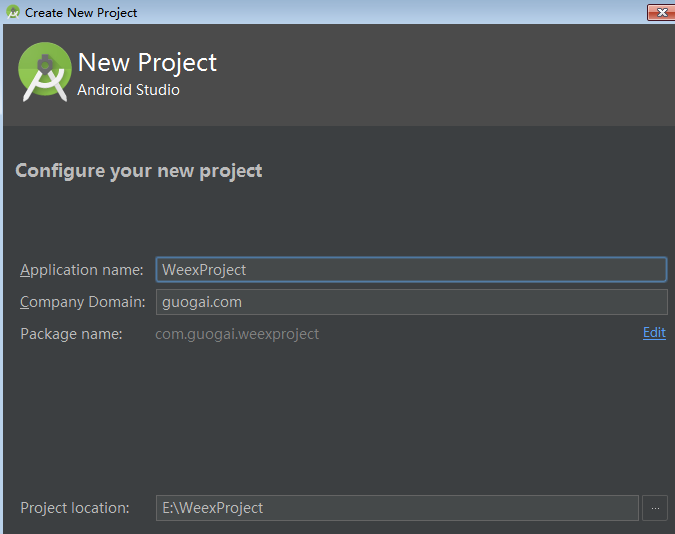
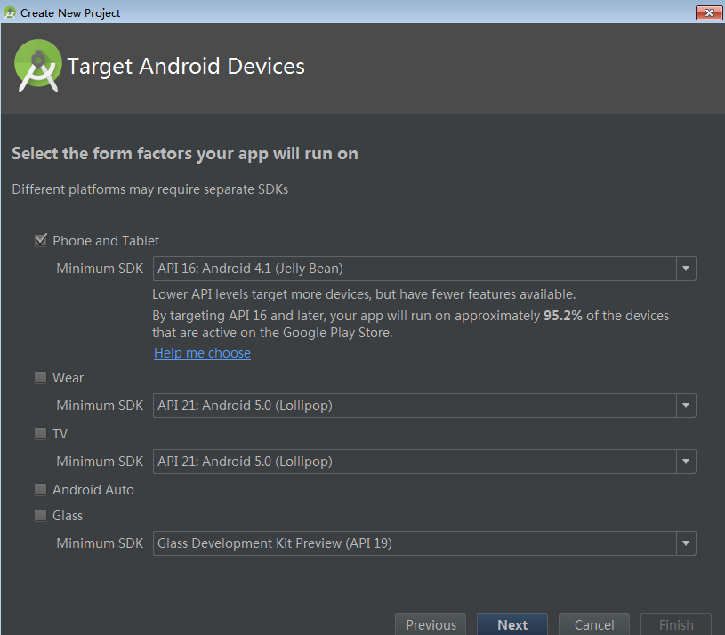
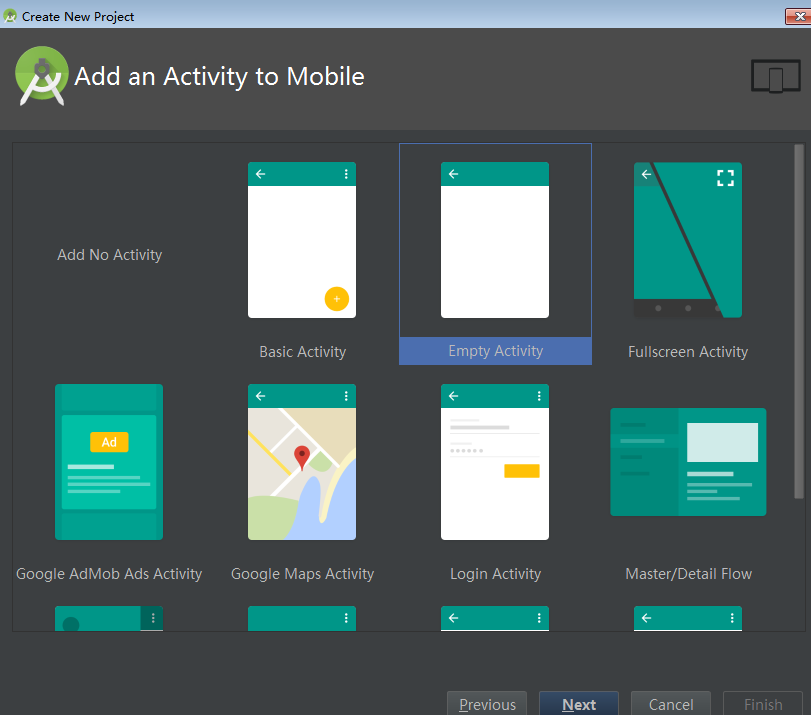
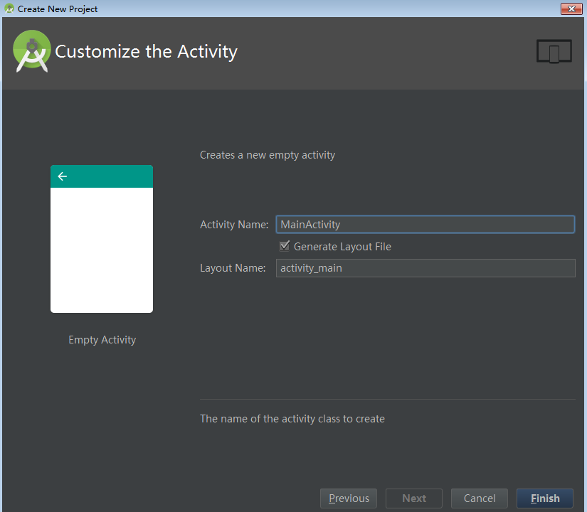
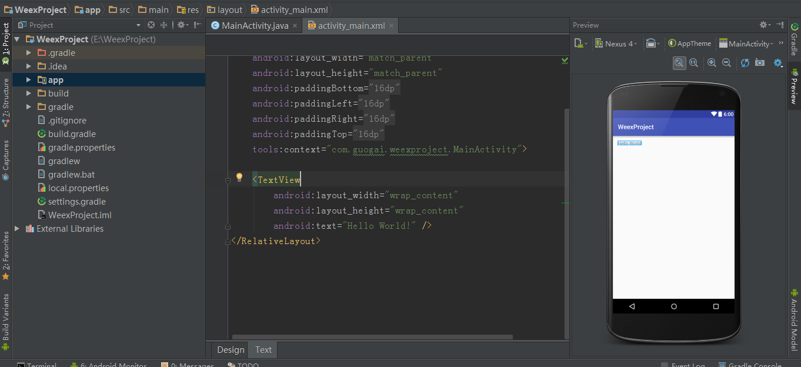
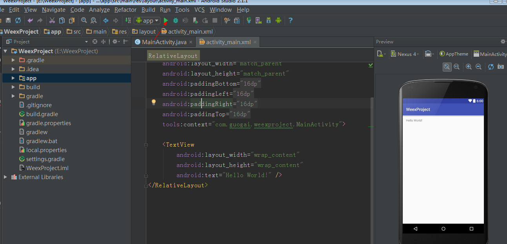
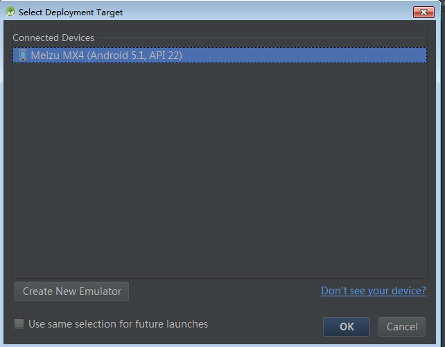
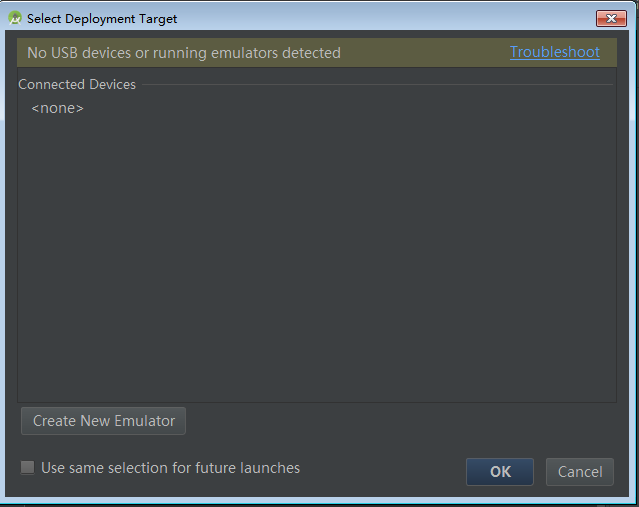
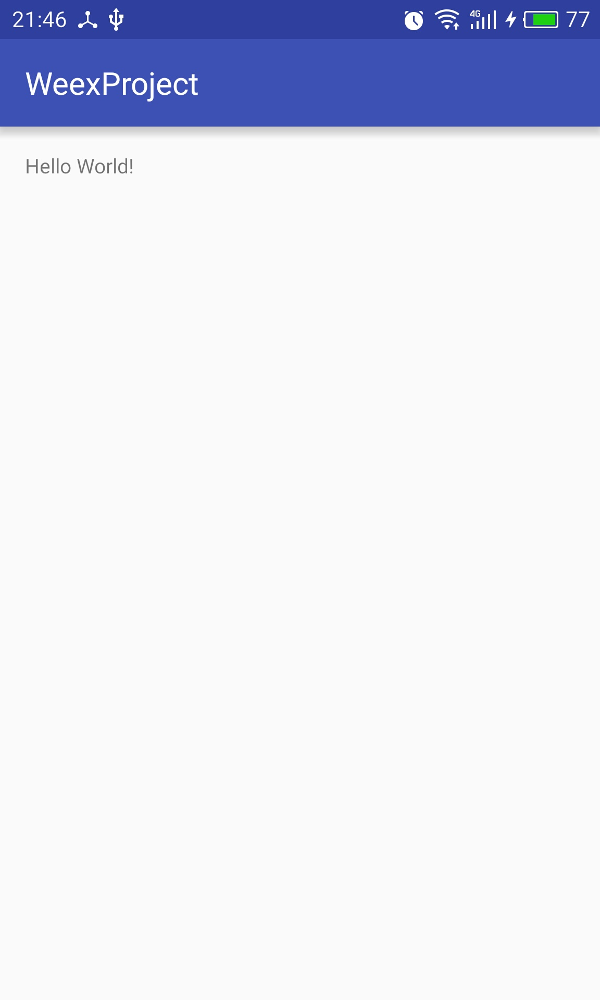

## 开发HelloWorld程序（Android原生）      
作者：@guogai          

    
- 1. 打开AndroidStudio新建一个Project
   
  

  

  
   
  

  

  至此，点击finish，等待AS创建工程完成。

  

   左边视图，显示的是我们工程的目录结构。中间MainActivity是Android的Activity组件，我们一般在这里做一些初始化，给空间绑定数据，网络请求和请求结果处理等操作。activitymian.xml是安卓的layout布局文件，我们在这里画界面，最右边是预览窗口，布局文件的改动都可以在预览窗口生效，可见即可得，当然你可以试试更改activity_main.xml文件TextView控件的text属性，看看预览效果。

   现在我们运行我们的程序，把它安装在我们的手机或者模拟器上面。选中我们的app(要运行的哪个module)点击下图红色箭头指示的地方或者选择导航栏的Run。

  

   出现下图，选择ok，app就会安装到我们的手机或者模拟器上。

  

   若出现下图，就说明，AS没有找到任何安卓设配，别急，打开手机设置--辅助功能--开发者选项--USB调试--选中即可。如果你是华为或者小米手机，找不到开发者选项，自行百度如何打开xxx手机开发者选项。

  
   
   运行后的效果是这样的：
  

  注：project和module，一个工程可以包含几个module，每个module可以是一个独立运行的app。
- 2. 好像1都说完了哎
