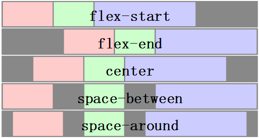
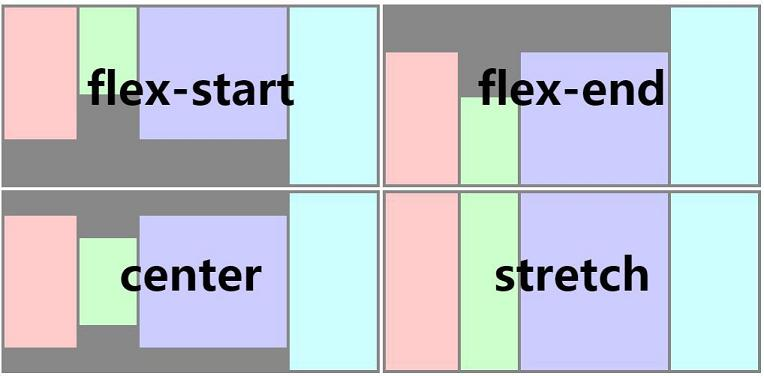
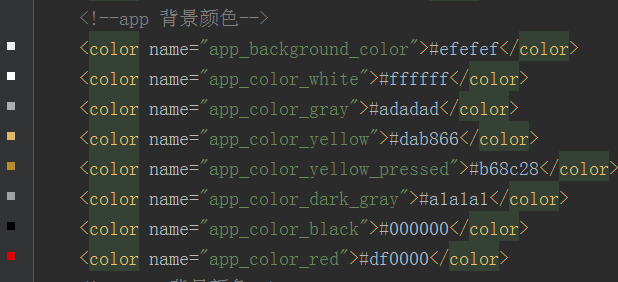

## 公共属性

- 1.id
    
        <text id="top">Top</text>  
 id是weex标签（即控件）在template下的唯一标识符，可以通过id来引用对应的weex标签。
         
        var top=this.$el('top')//通过this.el('id')找到标签
        dom.scrollToElement(top)//滚动到指定的标签
- 2.style
         
        style="width:200;height:200"
通过style可以为weex标签增加内联样式。
- 3.class
     
        class="button"
为weex标签增加类别，同一类别的标签可以设置公用的样式。
- 4.repeat
     
        repeat="{{items}}"
以{{items}}作为循环项，迭代生成当前的weex标签，那么这就是列表控件么？详细介绍 [详细介绍](https://github.com/weexteam/article/issues/12)
- 5.if

        <text if="{{true}}">Hello</text>//显示
        <text if="{{false}}">Hello</text>//不显示
true显示当前控件，会在DOM中渲染；false不显示，并从DOM中移除。简写if="true"。
- 6.append

        append="tree/node"
append属性决定标签的渲染流程是哪种。[详细介绍](https://github.com/weexteam/article/issues/7)
- 7.onXXX
       
        onclick="gotoNext"
        onappear="showAnim"
为weex标签注册事件处理函数。[详细介绍](https://github.com/weexteam/article/issues/15)
## 公共样式
- 1.盒子模型（Box Model）

  

    weex的盒子模型是基于CSS盒模型，每个标签从内到外依次是内容（content）、内边距(padding)、边框(border)、外边距(margin)。但是标签的大小在计算的时候是不包含margin的。其实对于Android原生也是这样计算控件的大小的。
- 2.Flexbox
   
        weex的布局模型也是基于CSS的Flexbox,Flexbox包含flex容器和flex元素。
         
       Flex容器
          
        - flex-direction:row|column 定义容器中元素的排列方向，默认是row(从左往右，从上往下)，会自动换行，在这点android原生是没有这样的效果的。
        - justify-content:flex-start|flex-end|center|space-between 定义了容器中元素在水平方向如何排列。flex-start 是默认值，即左对齐，所有的 flex 成员项都排列在容器的前部；flex-end 则意味着右对齐，成员项排列在容器的后部；center 即中间对齐，成员项排列在容器中间、两边留白；space-between 表示两端对齐，空白均匀地填充到 flex 成员项之间。
        - align-items:stretch|flex-start|center|flex-end 定义了容器中元素在垂直方向如何排列。stretch 是默认值，即拉伸高度至 flex 容器的大小；flex-start 则是上对齐，所有的成员项排列在容器顶部；flex-end 是下对齐，所有的成员项排列在容器底部；center 是中间对齐，所有成员项都垂直地居中显示。
       
       

       
 
       Flex元素

         flex: <number> flex 属性定义了 flex 成员项在容器中占据的尺寸。如果所有成员项都设置为 flex: 1，那么它们就有相等的宽度（水平排列）或者相等的高度（垂直排列）。如果一共有两个成员项，其中一个 flex: 1，另一个 flex: 2，那么第一个将占据 1/3 的空间，另一个占据 2/3。如果所有 flex 成员项都不设置 flex 属性，它们将根据容器的 justify-content 属性来决定如何排列。
- 3.定位
   
        -position:relative|absolute|fixed|sticky relative 是默认值，指的是相对定位；absolute 是绝对定位，以元素的容器作为参考系；fixed 保证元素在页面窗口中的对应位置显示；sticky 指的是仅当元素滚动到页面之外时，元素会固定在页面窗口的顶部。
        -top:<number> 距离上方的偏移量，默认0
        -bottom:<number>距离下方的偏移量，默认0
        -left:<number>距离左方的偏移量，默认0
        -right:<number>距离右方的偏移量，默认0

- 4.opacity:<number> 透明度
   
        取值范围为[0,1]。默认值为1，完全不透明；0完全透明；0.5是50%透明。
- 5.background-color<color> 背景颜色
       
         默认为transparent
-6.取值类型
     
         -长度：在数字后跟px为单位，px可以省略。
         -颜色：RGB(rgb(255,0,0));RGBA(rgba(255,0,0,0.5));十六进制写法(#ffffff)；精简十六进制写法（#f00)；色值关键字。
        
      [色值](https://github.com/alibaba/weex/blob/doc/doc/references/color-names.md)
       
     对于资源文件android这边是统一管理，比如颜色会专门建立一个colors.xml，需要使用的时候直接去引用即可，这样做的好处是可以共用很多，不用在每个地方都去填写具体的色值。

      
        
   [参考](https://github.com/weexteam/article/issues/23)

## 公共事件
- 1.click事件
    
        <text onClick="smile">click me</text>
    某个标签被绑定click事件，事件会在用户点击改标签时触发
- 2.appear事件
    
    某个标签被绑定了appear事件，该标签在滚入可见窗口时候触发
- 3.disappear事件
    
     某个标签被绑定了disappear事件，该标签在滚出可见窗口时触发。

     [详细介绍](https://github.com/weexteam/article/issues/33)

## 延伸阅读
- 1.Android适配方案 [传送门](http://www.cocoachina.com/android/20151030/13971.html)

     通过安卓适配方案，可以了解几组概念：

         屏幕尺寸、屏幕分辨率、屏幕像素密度                        
         px、dp、dip、sp
         mdpi、hdpi、xhdpi、xxhdpi
- 2.无论是公共属性、公共样式、公用事件，都可以在Android原生找到对应的影子，安卓上的大多数效果也可以在IOS上找到对应的影子。甚至可以说安卓在借鉴IOS的一些好的东西，IOS也在借鉴安卓的一些好的东西。所以我们应该把重点放在理解原理上。

## 测试
- 1.把三个image标签并排显示在一行，测试中间image的if属性，看看第三个iamge的位置。