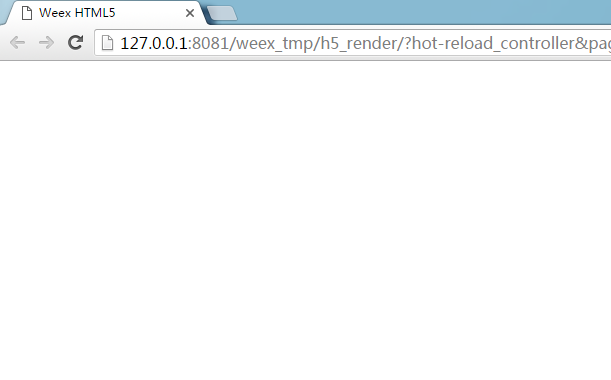
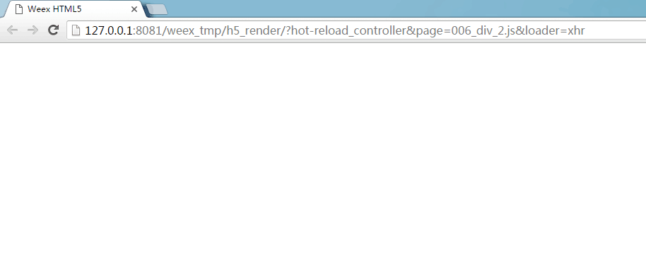
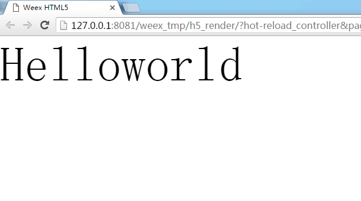

## div 标签
- 1.自我介绍
       
        一个基础容器标签。单独存在没有效果，但其他标签又必须成为它的子元素才可以显示，如果你写了一个text标签，编译.we源文件以后在浏览器里面显示不来效果，检查一下是否有div标签。
        延伸：div标签有点类似Android的ViewGroup容器控件，区别是其他标签可以单独显示。

       独立的div标签
          
        <template>
          

          

        </template>

        

        

    

     独立的text标签
     
        <template>
          <text>Helloworld</text>
        </template>

        

        

       
    
     包含子元素的div标签
    
        <template>
           

             <text>
                Helloworld
             </text>
           

       </template>
                
        

        

    
        
- 2.特征
   
        公共属性、公共样式、公共事件

## 注
- 1.动手试一试本节的练习，在命令行编译.we源码，看看浏览器里面的效果，或者按照开发HelloWorld(weex开发)那节把编译以后的.js文件放在app的assets文件夹下，在app里面看看效果。
- 2.公共属性、公共样式、公共事件是所有的标签都具有的特征。在Android的世界里，有两种基类，一个是非容器的控件View，一个是容器类的控件ViewGroup，所有继承自View或者ViewGroup的控件都会具有他们父亲所具有的特征。
- 3.div标签是否被你忘记了。