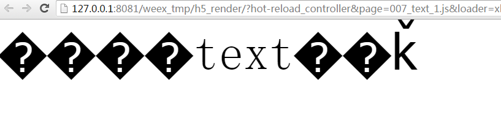
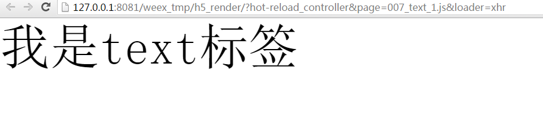
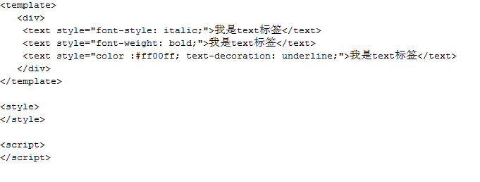
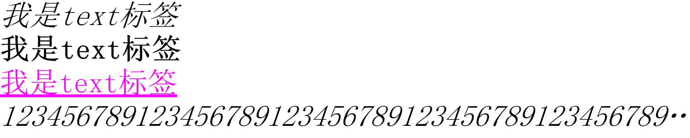
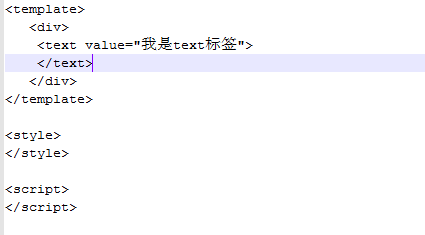
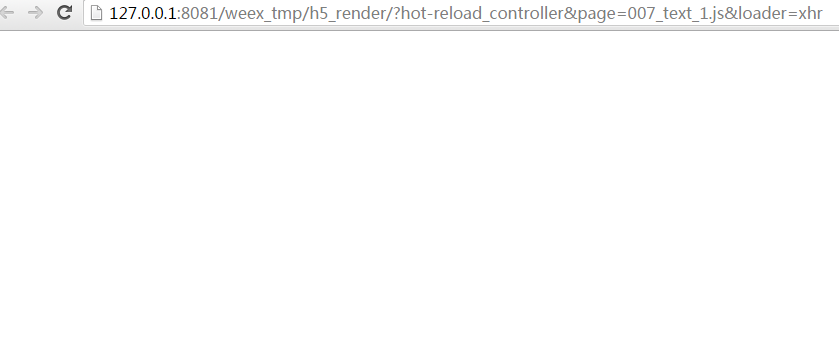

## text 标签
- 1.自我介绍
      
        text标签用来显示文本信息，属于非容器类标签。
        延伸：类似Android的TextView控件，当然Android的TextView控件功能是很强大的，毕竟源码10000多行。
    
       显示中文字符
        
        <template>
          

	       <text value="我是text标签"></text>
         

        </template>

        

        
      
     为什么显示的中文是乱码的？--设置编码方式为UTF-8，即可。   

     

      设置编码为UTF-8后以后的效果

     
- 2.特征

         -公共属性、公共样式、公共事件

         -其他样式：
         -lines:文本的行数，默认值0。
         -color:<colors> 文本颜色
         -font-size:<length>文字大小
         -font-style:<enum>normal|italic（斜体） 字体类别，默认值normal。
         -font-weight:<enum>normal|bold(粗体) 字体粗细程度，默认值为normal。
         -text-decoration:<enum>none|underline（下划线）|line-through（从中间穿过去的线） 字体装饰，默认值为none。
         -text-align:<enum>left|center|right 对齐方式，默认为left。
         -font-family:<string>字体家族。
         -text-overflow:<enum> clip|ellipsis 内容过长展示不下的省略样式。
         -line-height：sdk0.6.1新增的，稍后完善。

     注：enum的意思枚举，从后面可选的种类选择一种。
     
      源码:
    
    

      运行效果:
    
     
- 3.用法
         
        -多个样式之间用;分割
        

## 测试
- 1.同一种样式层叠使用有什么效果，比如font-weight同时设置normal和bold。

        后者生效。
## Q&A
- 1.明明给value属性赋值了，却没有显示？
- 
   
    
   编译以后空空如也？--稍后再回复，先避开这种写法。如果你的<text>和</text>是在同一行是不会有问题的。

   】

## 注
- 1.动手试一试本节的练习，在命令行编译.we源码，看看浏览器里面的效果，或者按照开发HelloWorld(weex开发)那节把编译以后的.js文件放在app的assets文件夹下，在app里面看看效果。
- 2.公共属性、公共样式、公共事件是所有的标签都具有的特征。在Android的世界里，有两种基类，一个是非容器的控件View，一个是容器类的控件ViewGroup，所有继承自View或者ViewGroup的控件都会具有他们父亲所具有的特征。
- 3.div标签是否被你忘记了。