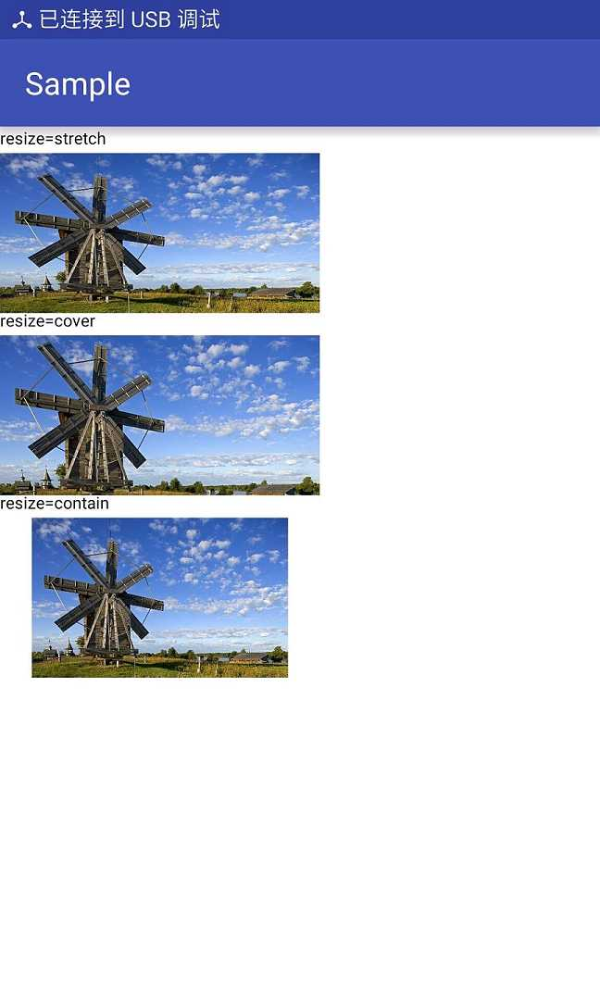
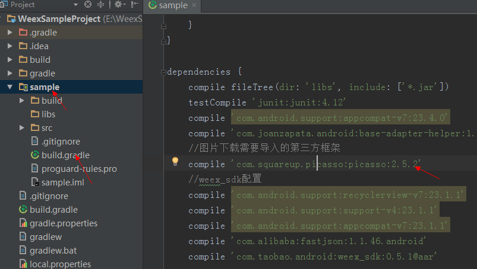
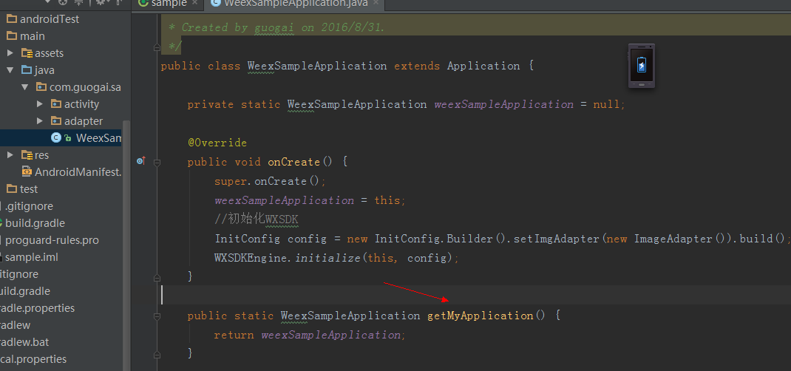
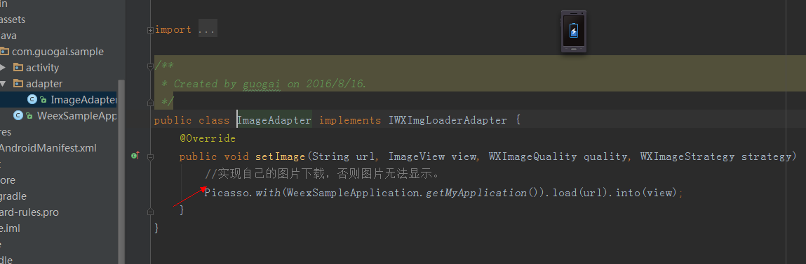

## image 标签
- 1.介绍
       
        image标签用来渲染一张图片，属于非容器类标签。简写img。
- 2.特征
      
        -公共属性、公共样式、公共事件
   
        -其他属性：
        -src:<字符串> 图片的url，目前暂时不支持本地图片。
        -resize<字符串> 组件的拉伸方式，默认stretch。

        -其他样式：
        -width:<长度> 标签的宽度（必须指定）
        -height:<长度> 标签的宽度（必须指定）

## image 标签在Android展示
- 1.手机运行后的效果

 
- 2.实现流程

（1）.在"开发HelloWorld程序（Weex开发）"那节的基础上。在Module的build.gradle文件中引入我们自己的图片加载框架。compile 'com.squareup.picasso:picasso:2.5.2'

 

（2）.在Application中提供一个能够获取到Context的方法，这个Context是图片加载框架需要的。当然最好能够采用单例的方法呀。

 

 (3).还记得我们之前空着的ImageAdapter么，现在可以实现自己的图片下载了。Picasso就是我们的图片加载框架，自行百度如何使用即可。

 

 (4).更换assets文件夹下面的js文件（经过.we文件编译后的）。

附.we源码：

     <template>
    

	    <text>resize=stretch</text>
        <image class="icon1" src="http://www.bz55.com/uploads1/allimg/120312/1_120312100435_8.jpg"></image>
		<text>resize=cover</text>
        <image class="icon2" src="http://www.bz55.com/uploads1/allimg/120312/1_120312100435_8.jpg"></image>
		<text>resize=contain</text>
        <image class="icon3" src="http://www.bz55.com/uploads1/allimg/120312/1_120312100435_8.jpg"></image>
    

</template>

## 注
- 1.动手试一试本节的练习，在命令行编译.we源码，看看浏览器里面的效果，或者按照开发HelloWorld(weex开发)那节把编译以后的.js文件放在app的assets文件夹下，在app里面看看效果。
- 2.公共属性、公共样式、公共事件是所有的标签都具有的特征。在Android的世界里，有两种基类，一个是非容器的控件View，一个是容器类的控件ViewGroup，所有继承自View或者ViewGroup的控件都会具有他们父亲所具有的特征。
- 3.div标签是否被你忘记了。