## 开发HelloWorld程序（Weex开发）
- 1.新建一个Module(一个Module就相当于一个app)

        如果已经有一个Project，那么可以直接新建一个Module，如果没有先去新建一个Project。
   如图：

   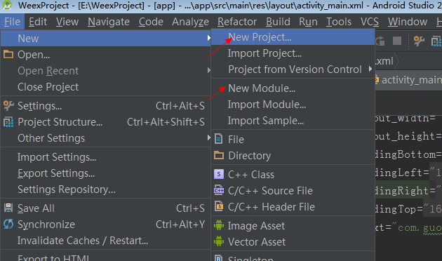

    创建工程，可以参考“开发HelloWorld程序(Android原生)”

   

   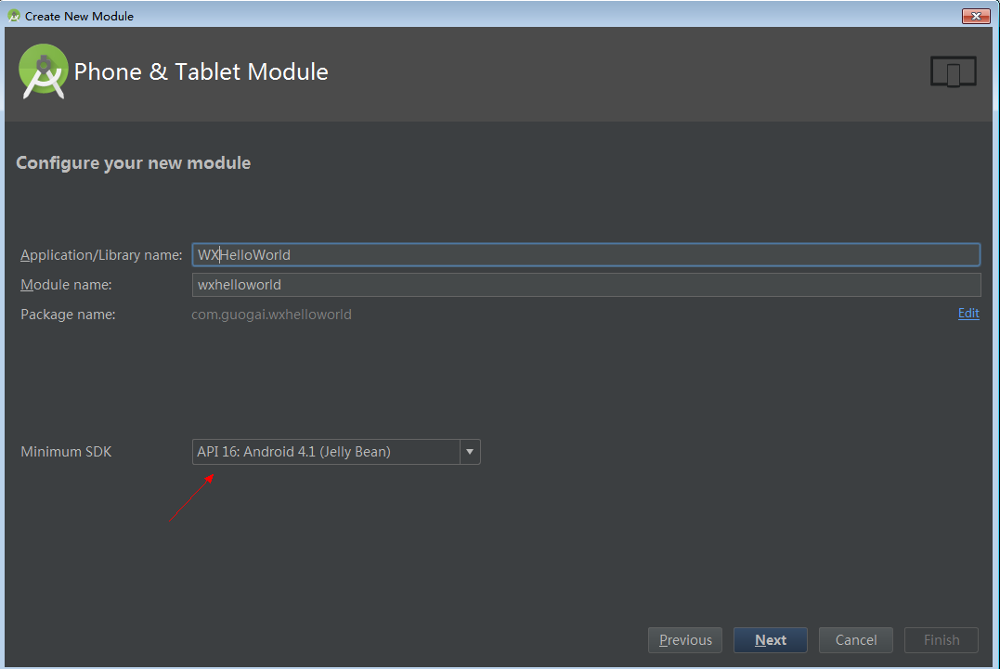
   
    这里的Minumum SDK要选择API16及以上，Weex目前只支持到API16级以上。

   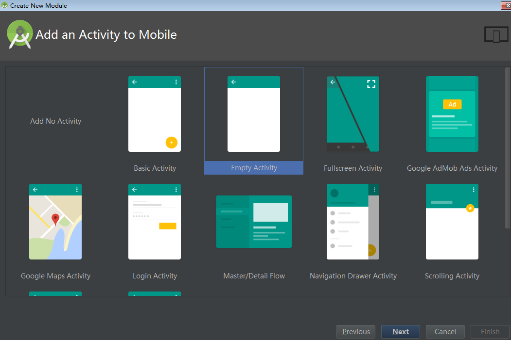
   
   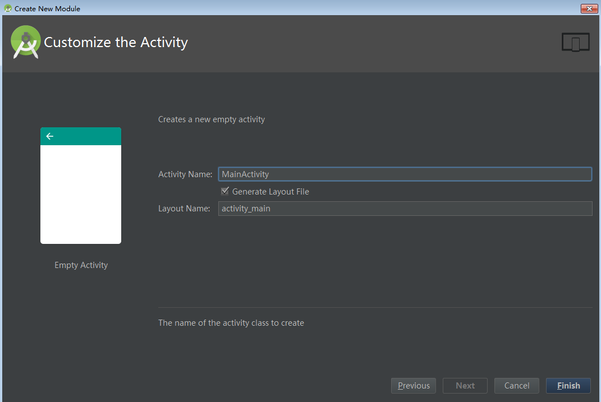

   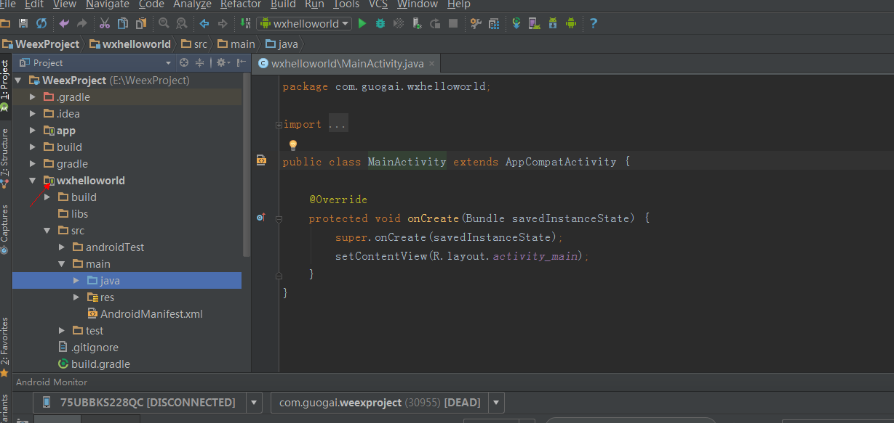

     这个时候我们WXHelloWorld程序的原生壳子就创建好了，接下来进入weex环节。
- 2.给Module集成WeexSDK
    
    给module的build.gradle文件添加如下配置

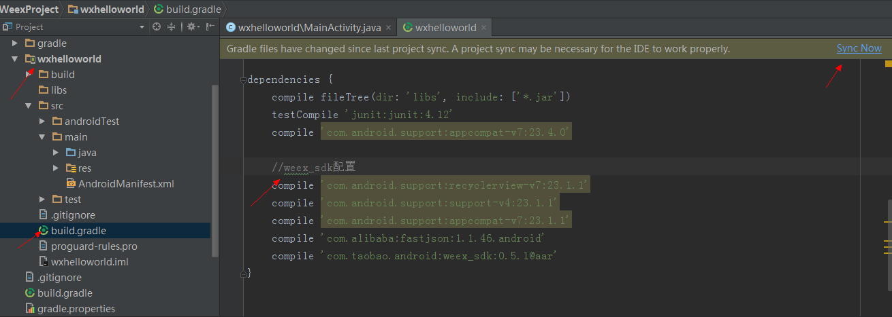

    添加完以后，点击Sync Now去同步配置即可，至此，weex sdk已经集成完毕。

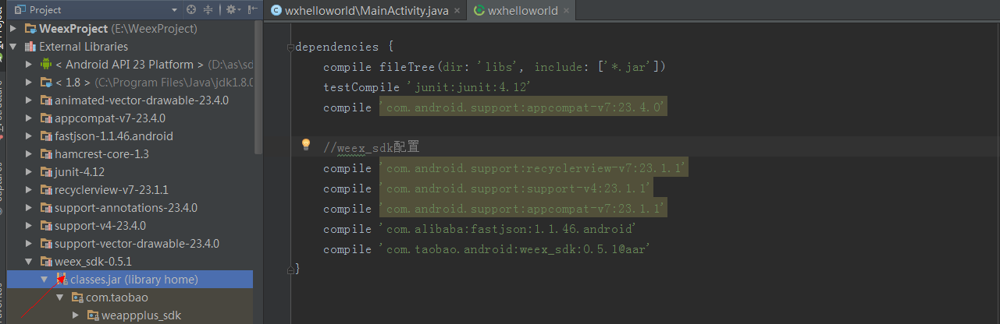
  
    集成完sdk以后，我们可以在AS中看到weex的源码。
- 3.开发.we源码
   
    使用notepad++或者记事本等开发如下源码，保存文件扩展名为.we即可，自行百度关键字如何显示文件扩展名。

 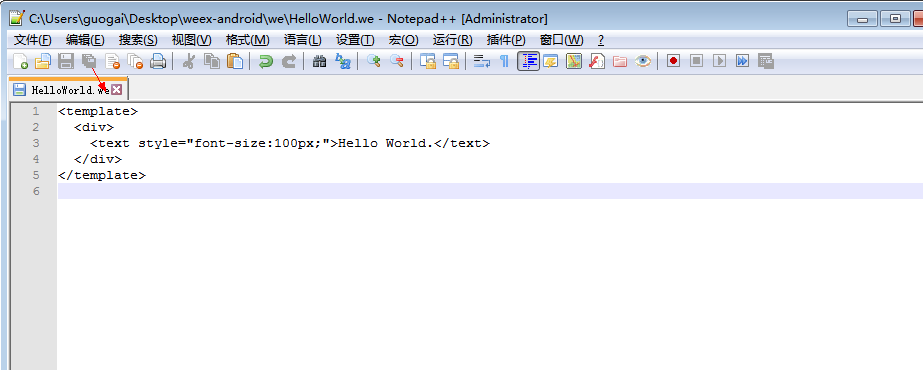

- 4.编译.we源码为js文件
  
    打开命令行，cd到.we源码的目录，执行：weex xxx.we

 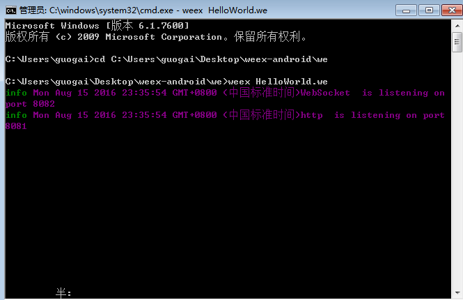

    没有报错，编译成功，会自动打开浏览器，在浏览器显示我们开发的界面，在源码相应的文件夹也会生成js文件。

 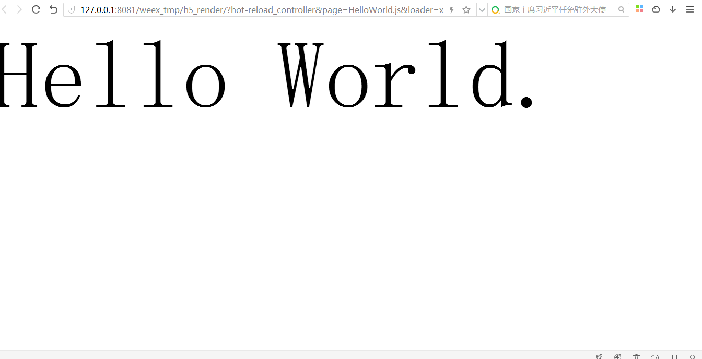

    在浏览器运行后的效果。

 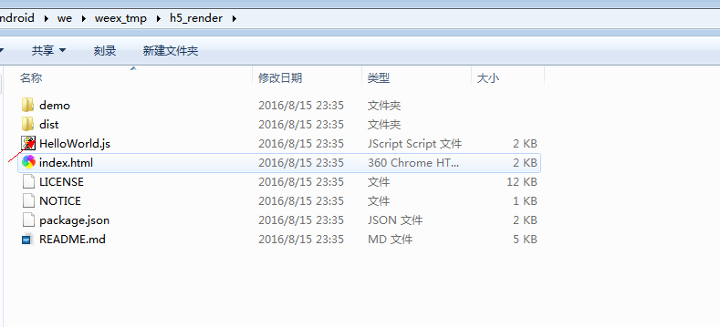

    编译.we源码生成的js文件，可以在源码的同级目录下找到。
- 5.初始化sdk

        5.1 实现图片下载适配器，如果项目中有图片展示，必须实现，否则图片无法显示。在刚刚的Module新建一个ImageAdapter类，实现IWXImgLoaderAdapter接口。由于我们这里展示的是HelloWorld，所以可以先不写具体的setImage（）方法里面的实现。

 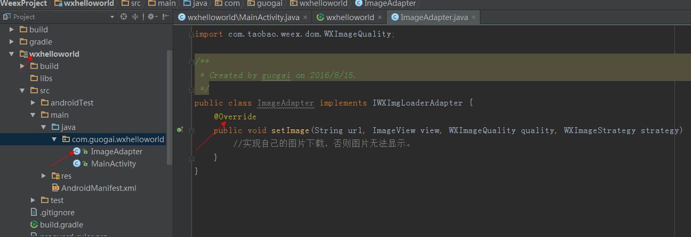

       5.2 在Module的Application的onCreate（）处初始化WeexSDK。
           public class HelloWorldApplication extends Application {
              @Override
              public void onCreate() {
                    super.onCreate();
                    //初始化WXSDK
                    InitConfig config = new InitConfig.Builder().setImgAdapter(new ImageAdapter()).build();
                   WXSDKEngine.initialize(this, config);
        }
      }

 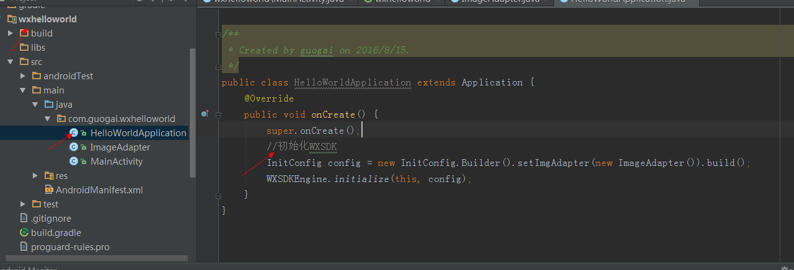

      5.3 在Module的AndroidManifest文件设置android:name=".HelloWorldApplication"

 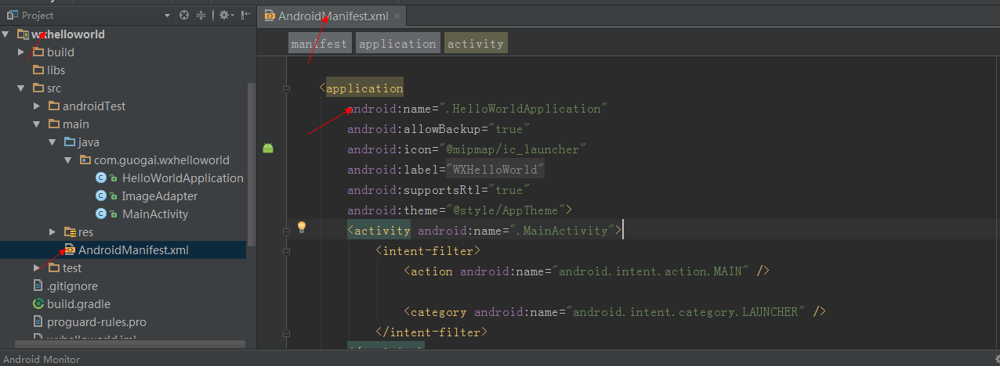

- 6.实现渲染
   
        6.1 先去掉原生的效果，防止干扰，把原生的activity_main.xml里面的TextView控件删除。

        6.2 把编译后生成的.js文件复制到Module的asserts资源文件夹下面

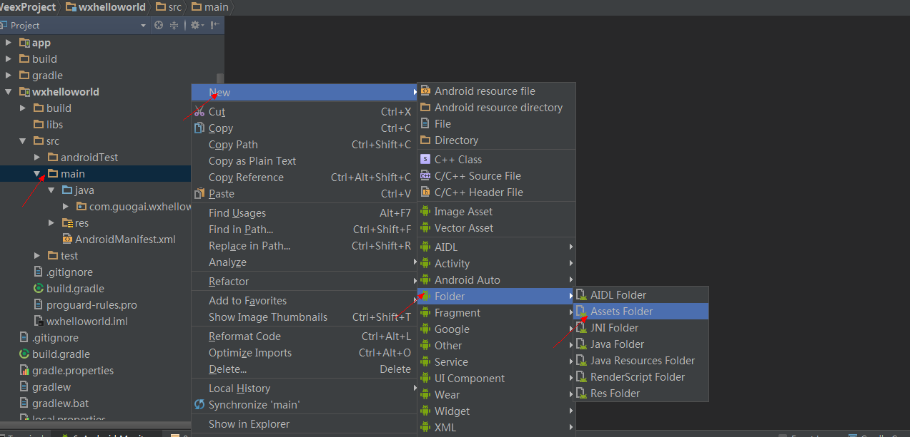

       6.3 在Module的Activity实现渲染   
    public class MainActivity extends AppCompatActivity implements IWXRenderListener {
    private WXSDKInstance mWXSDKInstance;

    @Override
    protected void onCreate(Bundle savedInstanceState) {
        super.onCreate(savedInstanceState);
        setContentView(R.layout.activity_main);
        initWXSDKInstance();
    }

    /**
     * 初始化WXSDKInstance
     */
    private void initWXSDKInstance() {
        mWXSDKInstance = new WXSDKInstance(this);
        mWXSDKInstance.registerRenderListener(this);
        /**
         * WXHelloWorld 可以替换成自定义的字符串，针对埋点有效。
         * template 是.we transform 后的 js文件。
         * option 可以为空，或者通过option传入 js需要的参数。例如bundle js的地址等。
         * jsonInitData 可以为空。
         * width 为-1 默认全屏，可以自己定制。
         * height =-1 默认全屏，可以自己定制。
         */
        mWXSDKInstance.render("WXHelloWorld", WXFileUtils.loadFileContent("HelloWorld.js", this), null, null, -1, -1, WXRenderStrategy.APPEND_ASYNC);
    }

    @Override
    public void onViewCreated(WXSDKInstance instance, View view) {
        //这里不能少
        setContentView(view);
    }

    @Override
    public void onRenderSuccess(WXSDKInstance instance, int width, int height) {

    }

    @Override
    public void onRefreshSuccess(WXSDKInstance instance, int width, int height) {

    }

    @Override
    public void onException(WXSDKInstance instance, String errCode, String msg) {

    }

    @Override
    protected void onResume() {
        super.onResume();
        if (mWXSDKInstance != null) {
            mWXSDKInstance.onActivityResume();
        }
    }

    @Override
    protected void onPause() {
        super.onPause();
        if (mWXSDKInstance != null) {
            mWXSDKInstance.onActivityPause();
        }
    }

    @Override
    protected void onStop() {
        super.onStop();
        if (mWXSDKInstance != null) {
            mWXSDKInstance.onActivityStop();
        }
    }

    @Override
    protected void onDestroy() {
        super.onDestroy();
        if (mWXSDKInstance != null) {
            mWXSDKInstance.onActivityDestroy();
        }
    }
}

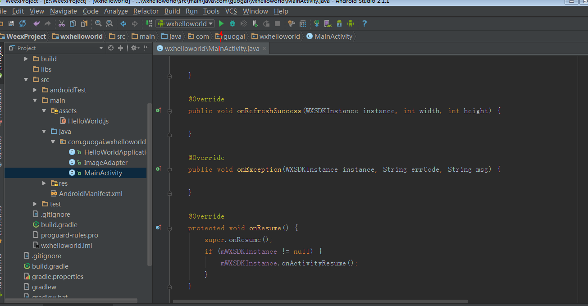

    
     6.4 点击红色箭头指示处，运行程序。

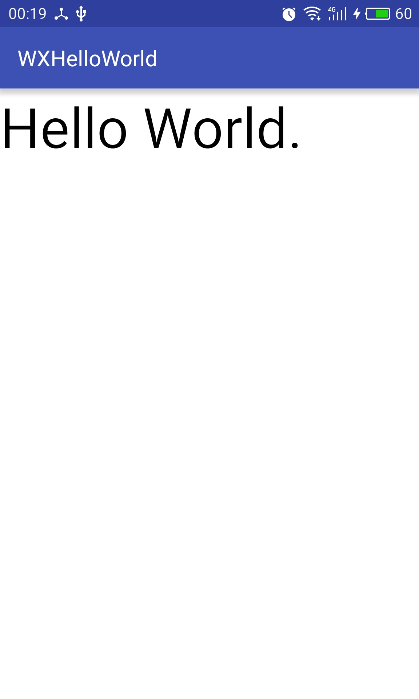

##Q&A
- 1.执行weex xxx.we编译报错
     
       
        一般报错是端口被占用，可以采用 cd到xxx.we然后执行weex xxx.we --qr，或者重启电脑（鬼脸）

- 2.找不到编译后的.js文件

        建议把we源码放在C盘某个文件夹下，其他盘下会报一些错误，具体原因还没测试。

